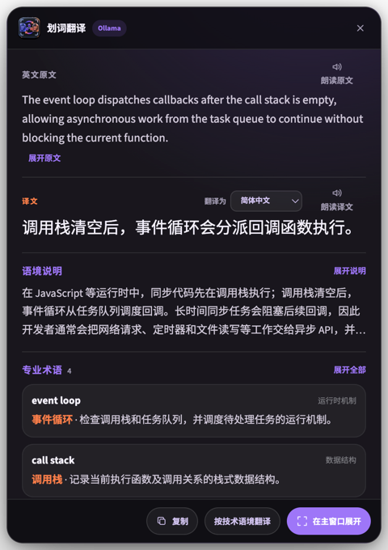

# 翻译

“翻译”是一个面向开发者的 macOS / Windows 全局翻译桌面应用。它不依赖浏览器扩展，可在编辑器、终端、聊天工具、PDF 阅读器等任意可复制文字的软件中工作。




## 当前功能

- 全局快捷键读取鼠标选中的文字；macOS 使用 accessory 应用策略与原生非激活 Panel 显示悬浮窗，不会切走或收起当前应用
- 按下截图快捷键后，在当前屏幕上直接显示透明多屏选区遮罩；拖动鼠标框选后，可拖动选框内部整体移动，也可通过四边与四角的透明拖拽区域精调范围，不再用圆点遮挡待识别内容；再点击“截图翻译”确认，右键或 Esc 可随时取消
- 悬浮窗支持拖动、复制、原文/译文朗读、关闭和展开到完整主窗口；译文语言可从列表重新选择并立即重译；长原文、语境说明与多条专业术语默认展示摘要，可按需展开
- 设置中可选择悬浮窗是否保持置顶；macOS 关闭置顶时仍会先显示在当前软件上方，点击外部后允许被其他软件覆盖，只在点击桌面空白区域时自动收起
- 界面采用中性浅灰、白色与蓝色强调的简洁主题，移除卡片和悬浮窗外围重阴影
- 主窗口输入停止后自动翻译，无需点击按钮；Codex 模式使用更长防抖以节省额度
- 独立顶部拖动带，拖动窗口时不会选中标题或设置文字
- 简洁桌面界面、可录制并修改划词、截图及显示/隐藏悬浮窗三组全局快捷键；支持单独按 Alt 等修饰键触发，悬浮窗快捷键可重新显示上一次翻译
- 英文单词显示原词 IPA，英文短语和句子不显示音标；原文与译文朗读按钮明确区分
- 中文译文可使用 Mac mini 的 MamboTTS / GPT-SoVITS 曼波音色；只在点击朗读时加载，音频生成后自动关闭模型
- 通过模型判断与本地技术词识别双重检测前端、后端、DevOps、数据库、云计算、嵌入式等 IT 内容，并在译文出现后继续补充实际用途
- TranslateGemma 主翻译 + Qwen 技术术语解析的本地混合链路，并在 TranslateGemma 不可用时自动回退 Qwen
- 单个英文词在 TranslateGemma 完成翻译后仍由 Qwen 判断专业含义并补充名词解析
- Ollama、Google Cloud Translation、ChatGPT/Codex 额度（实验）、OpenAI Responses API、通用 OpenAI Chat Completions 兼容接口
- 显示当前版本，并支持在应用内检查、下载和一键安装 GitHub Release 更新
- Ollama 技术解析模型与主翻译模型均从当前服务读取已安装模型，以列表方式选择
- Codex 模型下拉列表从当前登录账号的本机 Codex 目录动态读取
- API Key 通过 macOS Keychain / Windows DPAPI 对应的 Electron `safeStorage` 加密
- 设置固定保存在不随版本和安装包名称变化的 `translation` 用户数据目录；首次升级会自动迁移旧版配置，并保留上一份有效设置作为损坏回退
- macOS / Windows 自动构建工作流

## 为什么默认推荐 Mac mini + Ollama

ChatGPT/Codex 与 API Platform 的认证及计费是分开的。普通 OpenAI API 请求不能直接消耗 Plus 额度，但官方 Codex CLI 支持 ChatGPT 登录和非交互调用，所以本应用提供三条路径：

1. **局域网本地模型（默认）**：Mac mini 运行 Ollama，Mac 和 Windows 客户端都访问它。没有按量 API 成本，数据不离开局域网。
2. **ChatGPT/Codex 额度（实验）**：调用本机官方 `codex exec`，复用 Codex 已保存的 ChatGPT 登录。本应用不读取 OAuth token。优点是使用订阅内 Codex 用量，缺点是每次启动代理的延迟较高。
3. **云端 API**：自行填写 OpenAI API Key，获得低延迟且稳定的复杂语境翻译质量。API 用量单独计费。

推荐在 16GB Mac mini 使用 `translategemma:4b` 生成主译文、`qwen3:8b` 判断技术内容并补充术语用途。TranslateGemma 是专用翻译模型，Qwen 更擅长结构化解释；应用会自动组合两者。未安装 TranslateGemma 时仍可直接使用 Qwen，不会中断翻译。

Ollama 模式会在应用启动和保存设置后预热主翻译模型，关闭思考输出，并让模型在内存中保留 30 分钟。第一次加载模型仍会比后续翻译慢；`Hello` 这类普通短文本只生成译文、英文 IPA 和朗读原文，不再等待技术说明。

## 使用 ChatGPT / Codex 额度

应用会自动检测 ChatGPT macOS 应用内置的 Codex CLI，也可以在设置中手动填写 `codex` 可执行文件路径。选择“ChatGPT / Codex 额度（实验）”后：

1. 点击“登录 ChatGPT”，在浏览器中完成官方登录。
2. 点击“检查登录状态”，确认显示 `Logged in using ChatGPT`。
3. 从模型下拉列表中选择当前账号可用的模型，或保留“自动选择”。
4. 保存设置并翻译。

这个实现使用官方稳定的 `codex exec` 非交互接口，并为每次翻译启用只读沙箱、临时会话和 JSON Schema 输出。它没有复刻 OpenClaw 的底层 OAuth token 存储或直接请求 `chatgpt.com/backend-api`，因此账号边界更清晰，也更不容易因私有路由变化而失效。

## 使用曼波中文语音

设置中的“语音朗读”默认指向 `~/manbo/MamboTTS-macOS-port` 和 `http://127.0.0.1:9880`。点击中文朗读后，macOS 版会通过已有的 `GPTSoVits` Conda 环境自动启动模型，生成并缓存 WAV 音频，然后立即关闭模型；模型不可用时回退到系统中文语音。悬浮窗原文区域的“朗读原文”支持英文单词、短语和完整句子，并使用系统英文音色。

Mac mini 版会运行一个很轻量的局域网后台桥（端口 `19876`），它本身不加载语音模型。Windows 点击中文朗读时，会根据已设置的远程 Ollama 地址自动找到这个桥，在 Mac mini 上按需启动曼波、取得音频并关闭模型。

## 开发运行

需要 Node.js 22 或更高版本。项目锁定使用 pnpm 11。

```bash
corepack enable
pnpm install
pnpm dev
```

首次使用 macOS 时：

- 划词翻译需要在“系统设置 → 隐私与安全性 → 辅助功能”中允许“翻译”。
- 截图翻译需要在“系统设置 → 隐私与安全性 → 屏幕录制”中允许“翻译”。
- OCR 语言数据首次使用时会下载并缓存，首次识别会比之后慢。
- Ollama 不是应用内置组件，需要先安装并启动；设置页会检查服务和模型状态。

## 在 Mac mini 开启局域网翻译

先安装 [Ollama](https://ollama.com/)，并安装两个模型：

```bash
ollama pull qwen3:8b
ollama pull translategemma:4b
```

查看 Mac mini 的局域网 IP：

```bash
ipconfig getifaddr en0
```

保持 Mac mini 版“翻译”在后台运行。在 Windows 版设置中可继续填写：

```text
http://<Mac-mini-局域网-IP>:11434
```

然后点击“测试连接”。若 11434 没有直接对局域网开放，Windows 会自动尝试 `http://<Mac-mini-IP>:19876/ollama`，因此不再需要在终端运行 `OLLAMA_HOST=0.0.0.0:11434 ollama serve`。后台桥只接受回环、私有局域网和网线直连的链路本地地址；仍建议只在可信网络使用。

## Google Cloud Translation

设置中可选择“Google Cloud Translation”并填写 Cloud Translation Basic API Key。它的优势是延迟稳定、语言覆盖广，适合作为云端备用；代价是文本会发送到 Google Cloud 且按用量计费。技术文本完成主翻译后，应用仍尝试调用 Mac mini 的 Qwen 补充术语解释。默认继续推荐本地 TranslateGemma + Qwen，以保持隐私和避免按量费用。

## 应用内更新

设置页会显示当前版本。点击“检查更新”后可直接下载，完成后点击“立即安装”。自动更新读取 GitHub Release 中由 `electron-builder` 生成的更新元数据；旧版 Release 缺少元数据时只显示简短兼容提示，不会暴露内部错误栈。推送 `v*` 标签会同时构建 macOS、Windows 安装包并创建 Release。Windows 使用 NSIS 增量更新；macOS 正式分发时应配置 Apple Developer 签名与公证，以保证更新安装稳定。

## 验证与打包

```bash
pnpm typecheck
pnpm test
pnpm build:mac
```

Windows 安装包应在 Windows 上构建：

```powershell
corepack enable
pnpm install --frozen-lockfile
pnpm build:win
```

推送 `v*` 标签或手动运行 GitHub Actions 的“构建桌面安装包”工作流，会分别在 macOS 和 Windows 构建环境中生成安装包。

## 已知边界

- 某些受保护应用或密码输入框不允许自动复制文字，这是操作系统/应用的安全限制。
- macOS 划词快捷键依赖“辅助功能”权限；截图依赖“屏幕录制”权限。
- OCR 首次运行需要下载所选语言包。之后从用户目录缓存加载。
- 当前 Windows 构建目标为 x64；如需 arm64，可在 `package.json` 的 builder 配置中增加目标架构。
- 本项目参考 Immersive Translate 的“随处触发、上下文翻译、专业术语解释”产品思路；其当前公开仓库不是源代码仓库，本项目未复制其实现。

## 许可证

MIT
